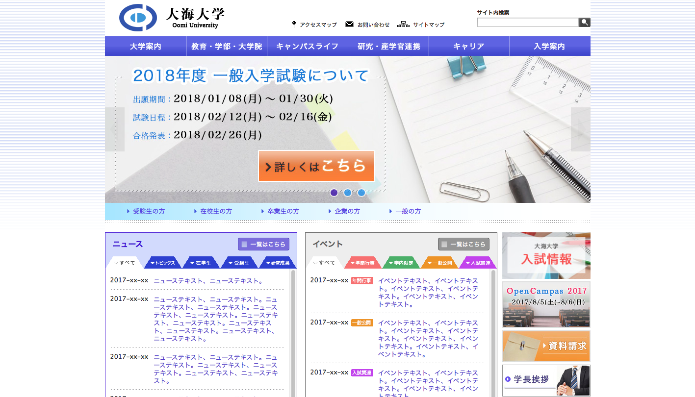
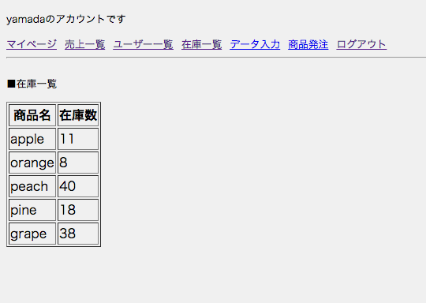

# portfolio

今まで作成したサンプルサイト、およびphp学習実績の一部です。

その他社内で作ったツールもございますが、社外秘のためこちらには載せていません。
***
### サンプルサイト
- [大海大学（私立大学）](http://my.internetacademy.jp/~a31607127/academy/index.html)




<br>
- [須臾 - Shibaraku - （和カフェ）](http://my.internetacademy.jp/~a31607127/wacafe/index.html)


<br>
- [APRICUS TOKYO （結婚式場）](http://my.internetacademy.jp/~a31607127/wedding/index.html)
※こちらは作成途中になります


***
### php学習ログ
- セッションを利用したログイン機能、MYSQLを利用した在庫管理機能、発注後のメール機能 等を実装しました。
- ローカルのMAMP上で動くもののため、あくまでコードのみの提示となります。
- ファイル構造は以下の通りです。
```
|--php_practice
|  |--#1
|  |  |--#1.1
|  |  |  |--admin.php
|  |  |  |--insert.php
|  |  |  |--order.php
|  |  |  |--sample.php
|  |  |  |--show_all.php
|  |  |  |--style.css
|  |  |  |--tmpl
|  |  |  |  |--admin.tmpl
|  |  |  |  |--average.tmpl
|  |  |  |  |--change.tmpl
|  |  |  |  |--data.tmpl
|  |  |  |  |--edit.tmpl
|  |  |  |  |--error.tmpl
|  |  |  |  |--insert.tmpl
|  |  |  |  |--insert_form.tmpl
|  |  |  |  |--logout.tmpl
|  |  |  |  |--order_conf.tmpl
|  |  |  |  |--order_conf_data.tmpl
|  |  |  |  |--order_form.tmpl
|  |  |  |  |--order_form_data.tmpl
|  |  |  |  |--order_send.tmpl
|  |  |  |  |--sale_all.tmpl
|  |  |  |  |--sale_data.tmpl
|  |  |  |  |--sale_date.tmpl
|  |  |  |  |--staff.tmpl
|  |  |  |  |--stock_all.tmpl
|  |  |  |  |--stock_data.tmpl
|  |  |  |  |--user_all.tmpl
|  |--DbManager.php
|  |--Encode.php
```

#### 概要
1. admin.phpをブラウザでアクセス、セッションが残っていない状態ではログイン画面となる。


1. IDやPASSWORDを間違えるとエラー。


1. ログイン後のメインメニュー。


1. 売上一覧メニュー。日付を選ぶとその日の売上一蘭が表示される。


1. また、一定期間の日当たりの平均販売数も出せる。


1. ユーザー一覧メニュー。DBに登録しているユーザーの情報を見れる。また、個々の購入履歴も表示できる。


1. 在庫一覧メニュー。DBに登録している商品の在庫数を見れる。


1. 商品発注メニュー。ここから商品を購入出来る。


1. 配送希望日を発注日から7日より前にするとエラーとなる。


1. 商品発注確認画面。


1. 発注確定後画面。


1. 発注確定後、メールが送られてくる。


1. 発注したappleの在庫が更新され、一つ減る。


1. yamadaの購入履歴には、appleが一つ増える。

